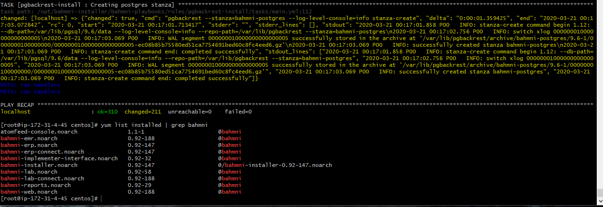

# Bhamani Application Deployment

We have completed Bahmni installation successfully.

1. Manual Installation
We have installed Bahmni manuallly on Centos Machine sucessfully, please find the screen shots.
update



2.  Installing with Jenkins freestyle

We have taken EC2 t2 medium, and installed Jenkins on the server.
On the same server we have installed Bahmni software with Jenkins freestyle, after successfully installed, we are not able to access Jenkin, seems there is some conflict happening with Jenkins and Bahmni software, due to this we are not able to get the Console Output of the job.

But overall we have installed without any issues.

Prevous attempt we are half way through with one error - Console Output of the job.

## jenkins output with one error

```
      
Running as SYSTEM
Building in workspace /var/lib/jenkins/workspace/Bahmni
[Bahmni] $ /bin/sh -xe /tmp/jenkins40695945343103604.sh
+ yum install -y https://kojipkgs.fedoraproject.org//packages/zlib/1.2.11/19.fc30/x86_64/zlib-1.2.11-19.fc30.x86_64.rpm
Loaded plugins: fastestmirror
Examining /var/tmp/yum-root-Rma91W/zlib-1.2.11-19.fc30.x86_64.rpm: zlib-1.2.11-19.fc30.x86_64
Marking /var/tmp/yum-root-Rma91W/zlib-1.2.11-19.fc30.x86_64.rpm as an update to zlib-1.2.7-18.el7.x86_64
Resolving Dependencies
--> Running transaction check
---> Package zlib.x86_64 0:1.2.7-18.el7 will be updated
---> Package zlib.x86_64 0:1.2.11-19.fc30 will be an update
--> Finished Dependency Resolution

Dependencies Resolved

================================================================================
 Package  Arch       Version              Repository                       Size
================================================================================
Updating:
 zlib     x86_64     1.2.11-19.fc30       /zlib-1.2.11-19.fc30.x86_64     226 k

Transaction Summary
================================================================================
Upgrade  1 Package

Total size: 226 k
Downloading packages:
Running transaction check
Running transaction test
Transaction test succeeded
Running transaction
  Updating   : zlib-1.2.11-19.fc30.x86_64                                   1/2 
  Cleanup    : zlib-1.2.7-18.el7.x86_64                                     2/2 
  Verifying  : zlib-1.2.11-19.fc30.x86_64                                   1/2 
  Verifying  : zlib-1.2.7-18.el7.x86_64                                     2/2 

Updated:
  zlib.x86_64 0:1.2.11-19.fc30                                                  

Complete!
+ yum install -y https://dl.bintray.com/bahmni/rpm/rpms/bahmni-installer-0.92-147.noarch.rpm
Loaded plugins: fastestmirror
Examining /var/tmp/yum-root-Rma91W/bahmni-installer-0.92-147.noarch.rpm: bahmni-installer-0.92-147.noarch
Marking /var/tmp/yum-root-Rma91W/bahmni-installer-0.92-147.noarch.rpm to be installed
Resolving Dependencies
--> Running transaction check
---> Package bahmni-installer.noarch 0:0.92-147 will be installed
--> Processing Dependency: python-devel for package: bahmni-installer-0.92-147.noarch
Loading mirror speeds from cached hostfile
 * base: d36uatko69830t.cloudfront.net
 * extras: d36uatko69830t.cloudfront.net
 * updates: d36uatko69830t.cloudfront.net
--> Processing Dependency: epel-release for package: bahmni-installer-0.92-147.noarch
--> Running transaction check
---> Package epel-release.noarch 0:7-11 will be installed
---> Package python-devel.x86_64 0:2.7.5-86.el7 will be installed
--> Processing Dependency: python2-rpm-macros > 3-30 for package: python-devel-2.7.5-86.el7.x86_64
--> Processing Dependency: python-rpm-macros > 3-30 for package: python-devel-2.7.5-86.el7.x86_64
--> Running transaction check
---> Package python-rpm-macros.noarch 0:3-32.el7 will be installed
--> Processing Dependency: python-srpm-macros for package: python-rpm-macros-3-32.el7.noarch
---> Package python2-rpm-macros.noarch 0:3-32.el7 will be installed
--> Running transaction check
---> Package python-srpm-macros.noarch 0:3-32.el7 will be installed
--> Finished Dependency Resolution

Dependencies Resolved

================================================================================
 Package            Arch   Version      Repository                         Size
================================================================================
Installing:
 bahmni-installer   noarch 0.92-147     /bahmni-installer-0.92-147.noarch 1.2 M
Installing for dependencies:
 epel-release       noarch 7-11         extras                             15 k
 python-devel       x86_64 2.7.5-86.el7 base                              398 k
 python-rpm-macros  noarch 3-32.el7     base                              8.8 k
 python-srpm-macros noarch 3-32.el7     base                              8.4 k
 python2-rpm-macros noarch 3-32.el7     base                              7.7 k

Transaction Summary
================================================================================
Install  1 Package (+5 Dependent packages)

Total size: 1.6 M
Total download size: 438 k
Installed size: 2.2 M
Downloading packages:
--------------------------------------------------------------------------------
Total                                              2.0 MB/s | 438 kB  00:00     
Running transaction check
Running transaction test
Transaction test succeeded
Running transaction
  Installing : python2-rpm-macros-3-32.el7.noarch                           1/6 
  Installing : python-srpm-macros-3-32.el7.noarch                           2/6 
  Installing : python-rpm-macros-3-32.el7.noarch                            3/6 
  Installing : python-devel-2.7.5-86.el7.x86_64                             4/6 
  Installing : epel-release-7-11.noarch                                     5/6 
  Installing : bahmni-installer-0.92-147.noarch                             6/6 
-------------Installing bahmni command line tool--------------
running install
running bdist_egg
running egg_info
creating bahmni.egg-info
writing requirements to bahmni.egg-info/requires.txt
writing bahmni.egg-info/PKG-INFO
writing top-level names to bahmni.egg-info/top_level.txt
writing dependency_links to bahmni.egg-info/dependency_links.txt
writing entry points to bahmni.egg-info/entry_points.txt
writing manifest file 'bahmni.egg-info/SOURCES.txt'
reading manifest file 'bahmni.egg-info/SOURCES.txt'
writing manifest file 'bahmni.egg-info/SOURCES.txt'
installing library code to build/bdist.linux-x86_64/egg
running install_lib
running build_py
creating build
creating build/lib
copying bahmni.py -> build/lib
creating build/bdist.linux-x86_64
creating build/bdist.linux-x86_64/egg
copying build/lib/bahmni.py -> build/bdist.linux-x86_64/egg
byte-compiling build/bdist.linux-x86_64/egg/bahmni.py to bahmni.pyc
creating build/bdist.linux-x86_64/egg/EGG-INFO
copying bahmni.egg-info/PKG-INFO -> build/bdist.linux-x86_64/egg/EGG-INFO
copying bahmni.egg-info/SOURCES.txt -> build/bdist.linux-x86_64/egg/EGG-INFO
copying bahmni.egg-info/dependency_links.txt -> build/bdist.linux-x86_64/egg/EGG-INFO
copying bahmni.egg-info/entry_points.txt -> build/bdist.linux-x86_64/egg/EGG-INFO
copying bahmni.egg-info/requires.txt -> build/bdist.linux-x86_64/egg/EGG-INFO
copying bahmni.egg-info/top_level.txt -> build/bdist.linux-x86_64/egg/EGG-INFO
zip_safe flag not set; analyzing archive contents...
creating dist
creating 'dist/bahmni-0.1-py2.7.egg' and adding 'build/bdist.linux-x86_64/egg' to it
removing 'build/bdist.linux-x86_64/egg' (and everything under it)
Processing bahmni-0.1-py2.7.egg
Copying bahmni-0.1-py2.7.egg to /usr/lib/python2.7/site-packages
Adding bahmni 0.1 to easy-install.pth file
Installing bahmni script to /usr/bin

Installed /usr/lib/python2.7/site-packages/bahmni-0.1-py2.7.egg
Processing dependencies for bahmni==0.1
Searching for Click
Reading https://pypi.python.org/simple/Click/
Best match: click 7.1.1
Downloading https://files.pythonhosted.org/packages/4e/ab/5d6bc3b697154018ef196f5b17d958fac3854e2efbc39ea07a284d4a6a9b/click-7.1.1.tar.gz#sha256=8a18b4ea89d8820c5d0c7da8a64b2c324b4dabb695804dbfea19b9be9d88c0cc
Processing click-7.1.1.tar.gz
Writing /tmp/easy_install-QGYOAv/click-7.1.1/setup.cfg
Running click-7.1.1/setup.py -q bdist_egg --dist-dir /tmp/easy_install-QGYOAv/click-7.1.1/egg-dist-tmp-QwwZLh
/usr/lib64/python2.7/distutils/dist.py:267: UserWarning: Unknown distribution option: 'project_urls'
  warnings.warn(msg)
/usr/lib64/python2.7/distutils/dist.py:267: UserWarning: Unknown distribution option: 'python_requires'
  warnings.warn(msg)
no previously-included directories found matching 'docs/_build'
warning: no previously-included files matching '*.pyc' found anywhere in distribution
zip_safe flag not set; analyzing archive contents...
click.core: module references __file__
Adding click 7.1.1 to easy-install.pth file

Installed /usr/lib/python2.7/site-packages/click-7.1.1-py2.7.egg
Finished processing dependencies for bahmni==0.1
  Verifying  : epel-release-7-11.noarch                                     1/6 
  Verifying  : python-devel-2.7.5-86.el7.x86_64                             2/6 
  Verifying  : python-srpm-macros-3-32.el7.noarch                           3/6 
  Verifying  : python2-rpm-macros-3-32.el7.noarch                           4/6 
  Verifying  : bahmni-installer-0.92-147.noarch                             5/6 
  Verifying  : python-rpm-macros-3-32.el7.noarch                            6/6 

Installed:
  bahmni-installer.noarch 0:0.92-147                                            

Dependency Installed:
  epel-release.noarch 0:7-11             python-devel.x86_64 0:2.7.5-86.el7    
  python-rpm-macros.noarch 0:3-32.el7    python-srpm-macros.noarch 0:3-32.el7  
  python2-rpm-macros.noarch 0:3-32.el7  

Complete!
+ bahmni --help
Usage: bahmni [OPTIONS] COMMAND [ARGS]...

Options:
  -I, --implementation TEXT       Option to specify the implementation config
                                  to be installed. Default value is default.
                                  If this options is used, implementation
                                  config folder has to be placed in /etc
                                  /bahmni-installer/deployment-artifacts with
                                  name <impelementation>_config

  -i, --inventory TEXT            Inventory file that needs to picked up from
                                  /etc/bahmni-installer

  -v, --verbose                   verbose operation
  -impl-play, --implementation_play TEXT
                                  Path of implementation specific ansible play
  -m, --migrate TEXT              Give a comma seperated list of modules to
                                  run migrations for. It has to be used with
                                  run_migrations command.Ex: bahmni --migrate
                                  erp,elis,mrs run_migrations

  -o, --only TEXT                 Install only specified components. Possible
                                  values can be bahmni-emr, bahmni-reports,
                                  bahmni-lab, bahmni-erp, dcm4chee, pacs-
                                  integration, bahmni-event-log-service

  -s, --skip TEXT                 Skip installation of specified components.
                                  Possible values can be bahmni-emr, bahmni-
                                  reports, bahmni-lab, bahmni-erp, dcm4chee,
                                  pacs-integration, bahmni-event-log-service

  -av, --ansible_version TEXT     Option to specify ansible version to be used
                                  for running installer playbooks

  --help                          Show this message and exit.

Commands:
  backup                      Used for taking backup of application artifact
                              files and databases

  concat-configs              Concatenating configs from
                              /var/www/bahmni_config/openmrs directory

  create-connect-artifacts    Creates artifacts for bahmni connect Initial
                              Sync configs

  install                     Installs bahmni components on respective hosts
                              specified in inventory file

  install-certs               Install SSL certificates using LetsEncrypt
  install-impl                Installs bahmni implementation specific
                              customizations on respective hosts specified in
                              inventory file

  install-nagios              Installs nagios server and nagios agents.
  restart                     restart all the services required for bahmni
  restore                     Used for restoring of application files and
                              databases

  run-migrations              Execute all/selected migrations
  setup-mysql-replication     sets up mysql db replication
  setup-postgres-replication  sets up postgres db replication
  start                       starts all the services required for bahmni
  stop                        stops all the services required for bahmni
  update-config               updates the implementation config from the
                              location /etc/bahmni-installer/deployment-
                              artifacts

  version                     Print the Bahmni installer version
+ curl -L https://tinyurl.com/yyoj98df
  % Total    % Received % Xferd  Average Speed   Time    Time     Time  Current
                                 Dload  Upload   Total   Spent    Left  Speed

  0     0    0     0    0     0      0      0 --:--:-- --:--:-- --:--:--     0
100   808    0   808    0     0   2033      0 --:--:-- --:--:-- --:--:--  2035

100   232  100   232    0     0    434      0 --:--:-- --:--:-- --:--:--   434
+ cat /etc/bahmni-installer/setup.yml
# To see the list of valid variables in Bahmni please refer to:
# https://bahmni.atlassian.net/wiki/display/BAH/List+Of+Configurable+Installation+Variables

timezone: Asia/Kolkata
implementation_name: default
selinux_state: disabled+ echo 'export BAHMNI_INVENTORY=local'
+ source /root/.bashrc
++ alias 'rm=rm -i'
++ alias 'cp=cp -i'
++ alias 'mv=mv -i'
++ '[' -f /etc/bashrc ']'
++ . /etc/bashrc
+++ '[' '' ']'
+++ shopt -q login_shell
+++ '[' 0 -gt 199 ']'
+++ umask 022
+++ SHELL=/bin/bash
+++ for i in '/etc/profile.d/*.sh'
+++ '[' -r /etc/profile.d/256term.sh ']'
+++ '[' '' ']'
+++ . /etc/profile.d/256term.sh
++++ local256=
++++ '[' -n '' ']'
++++ '[' -n '' ']'
++++ unset local256
+++ for i in '/etc/profile.d/*.sh'
+++ '[' -r /etc/profile.d/colorgrep.sh ']'
+++ '[' '' ']'
+++ . /etc/profile.d/colorgrep.sh
++++ /usr/libexec/grepconf.sh -c
++++ alias 'grep=grep --color=auto'
++++ alias 'egrep=egrep --color=auto'
++++ alias 'fgrep=fgrep --color=auto'
+++ for i in '/etc/profile.d/*.sh'
+++ '[' -r /etc/profile.d/colorls.sh ']'
+++ '[' '' ']'
+++ . /etc/profile.d/colorls.sh
++++ '[' '!' -t 0 ']'
++++ return
+++ for i in '/etc/profile.d/*.sh'
+++ '[' -r /etc/profile.d/lang.sh ']'
+++ '[' '' ']'
+++ . /etc/profile.d/lang.sh
++++ sourced=0
++++ '[' -n en_US.UTF-8 ']'
++++ saved_lang=en_US.UTF-8
++++ '[' -f /root/.i18n ']'
++++ LANG=en_US.UTF-8
++++ unset saved_lang
++++ '[' 0 = 1 ']'
++++ unset sourced
++++ unset langfile
+++ for i in '/etc/profile.d/*.sh'
+++ '[' -r /etc/profile.d/less.sh ']'
+++ '[' '' ']'
+++ . /etc/profile.d/less.sh
++++ '[' -x /usr/bin/lesspipe.sh ']'
++++ export 'LESSOPEN=||/usr/bin/lesspipe.sh %s'
++++ LESSOPEN='||/usr/bin/lesspipe.sh %s'
+++ for i in '/etc/profile.d/*.sh'
+++ '[' -r /etc/profile.d/which2.sh ']'
+++ '[' '' ']'
+++ . /etc/profile.d/which2.sh
++++ alias 'which=alias | /usr/bin/which --tty-only --read-alias --show-dot --show-tilde'
+++ unset i
+++ unset -f pathmunge
++ export BAHMNI_INVENTORY=local
++ BAHMNI_INVENTORY=local
+ bahmni install -y
sh: ansible: command not found
Loaded plugins: fastestmirror
Loading mirror speeds from cached hostfile
 * base: d36uatko69830t.cloudfront.net
 * epel: mirror.csis.ysu.edu
 * extras: d36uatko69830t.cloudfront.net
 * updates: d36uatko69830t.cloudfront.net
http://csc.mcs.sdsmt.edu/epel/7/x86_64/repodata/8c637a499aa738a6a30d640449027e0b4001e32742974bc70e68e1377328999f-updateinfo.xml.bz2: [Errno 12] Timeout on http://csc.mcs.sdsmt.edu/epel/7/x86_64/repodata/8c637a499aa738a6a30d640449027e0b4001e32742974bc70e68e1377328999f-updateinfo.xml.bz2: (28, 'Operation too slow. Less than 1000 bytes/sec transferred the last 30 seconds')
Trying other mirror.
Resolving Dependencies
--> Running transaction check
---> Package ansible.noarch 0:2.4.2.0-2.el7 will be installed
--> Processing Dependency: sshpass for package: ansible-2.4.2.0-2.el7.noarch
--> Processing Dependency: python2-jmespath for package: ansible-2.4.2.0-2.el7.noarch
--> Processing Dependency: python-passlib for package: ansible-2.4.2.0-2.el7.noarch
--> Processing Dependency: python-paramiko for package: ansible-2.4.2.0-2.el7.noarch
--> Processing Dependency: python-httplib2 for package: ansible-2.4.2.0-2.el7.noarch
--> Processing Dependency: python-cryptography for package: ansible-2.4.2.0-2.el7.noarch
--> Running transaction check
---> Package python-httplib2.noarch 0:0.9.2-1.el7 will be installed
---> Package python-paramiko.noarch 0:2.1.1-9.el7 will be installed
--> Processing Dependency: python2-pyasn1 for package: python-paramiko-2.1.1-9.el7.noarch
---> Package python2-cryptography.x86_64 0:1.7.2-2.el7 will be installed
--> Processing Dependency: python-idna >= 2.0 for package: python2-cryptography-1.7.2-2.el7.x86_64
--> Processing Dependency: python-cffi >= 1.4.1 for package: python2-cryptography-1.7.2-2.el7.x86_64
--> Processing Dependency: python-enum34 for package: python2-cryptography-1.7.2-2.el7.x86_64
---> Package python2-jmespath.noarch 0:0.9.0-3.el7 will be installed
---> Package python2-passlib.noarch 0:1.7.1-1.el7 will be installed
---> Package sshpass.x86_64 0:1.06-2.el7 will be installed
--> Running transaction check
---> Package python-cffi.x86_64 0:1.6.0-5.el7 will be installed
--> Processing Dependency: python-pycparser for package: python-cffi-1.6.0-5.el7.x86_64
---> Package python-enum34.noarch 0:1.0.4-1.el7 will be installed
---> Package python-idna.noarch 0:2.4-1.el7 will be installed
---> Package python2-pyasn1.noarch 0:0.1.9-7.el7 will be installed
--> Running transaction check
---> Package python-pycparser.noarch 0:2.14-1.el7 will be installed
--> Processing Dependency: python-ply for package: python-pycparser-2.14-1.el7.noarch
--> Running transaction check
---> Package python-ply.noarch 0:3.4-11.el7 will be installed
--> Finished Dependency Resolution

Dependencies Resolved

================================================================================
 Package                    Arch         Version             Repository    Size
================================================================================
Installing:
 ansible                    noarch       2.4.2.0-2.el7       extras       7.6 M
Installing for dependencies:
 python-cffi                x86_64       1.6.0-5.el7         base         218 k
 python-enum34              noarch       1.0.4-1.el7         base          52 k
 python-httplib2            noarch       0.9.2-1.el7         extras       115 k
 python-idna                noarch       2.4-1.el7           base          94 k
 python-paramiko            noarch       2.1.1-9.el7         base         269 k
 python-ply                 noarch       3.4-11.el7          base         123 k
 python-pycparser           noarch       2.14-1.el7          base         104 k
 python2-cryptography       x86_64       1.7.2-2.el7         base         502 k
 python2-jmespath           noarch       0.9.0-3.el7         extras        39 k
 python2-passlib            noarch       1.7.1-1.el7         epel         741 k
 python2-pyasn1             noarch       0.1.9-7.el7         base         100 k
 sshpass                    x86_64       1.06-2.el7          extras        21 k

Transaction Summary
================================================================================
Install  1 Package (+12 Dependent packages)

Total download size: 9.9 M
Installed size: 50 M
Downloading packages:
warning: /var/cache/yum/x86_64/7/epel/packages/python2-passlib-1.7.1-1.el7.noarch.rpm: Header V3 RSA/SHA256 Signature, key ID 352c64e5: NOKEY
Public key for python2-passlib-1.7.1-1.el7.noarch.rpm is not installed
--------------------------------------------------------------------------------
Total                                               16 MB/s | 9.9 MB  00:00     
Retrieving key from file:///etc/pki/rpm-gpg/RPM-GPG-KEY-EPEL-7
Importing GPG key 0x352C64E5:
 Userid     : "Fedora EPEL (7) <epel@fedoraproject.org>"
 Fingerprint: 91e9 7d7c 4a5e 96f1 7f3e 888f 6a2f aea2 352c 64e5
 Package    : epel-release-7-11.noarch (@extras)
 From       : /etc/pki/rpm-gpg/RPM-GPG-KEY-EPEL-7
Running transaction check
Running transaction test
Transaction test succeeded
Running transaction
  Installing : python2-pyasn1-0.1.9-7.el7.noarch                           1/13 
  Installing : python-enum34-1.0.4-1.el7.noarch                            2/13 
  Installing : python-httplib2-0.9.2-1.el7.noarch                          3/13 
  Installing : sshpass-1.06-2.el7.x86_64                                   4/13 
  Installing : python2-jmespath-0.9.0-3.el7.noarch                         5/13 
  Installing : python-ply-3.4-11.el7.noarch                                6/13 
  Installing : python-pycparser-2.14-1.el7.noarch                          7/13 
  Installing : python-cffi-1.6.0-5.el7.x86_64                              8/13 
  Installing : python2-passlib-1.7.1-1.el7.noarch                          9/13 
  Installing : python-idna-2.4-1.el7.noarch                               10/13 
  Installing : python2-cryptography-1.7.2-2.el7.x86_64                    11/13 
  Installing : python-paramiko-2.1.1-9.el7.noarch                         12/13 
  Installing : ansible-2.4.2.0-2.el7.noarch                               13/13 
  Verifying  : python-idna-2.4-1.el7.noarch                                1/13 
  Verifying  : python2-passlib-1.7.1-1.el7.noarch                          2/13 
  Verifying  : python-ply-3.4-11.el7.noarch                                3/13 
  Verifying  : python2-jmespath-0.9.0-3.el7.noarch                         4/13 
  Verifying  : python-paramiko-2.1.1-9.el7.noarch                          5/13 
  Verifying  : ansible-2.4.2.0-2.el7.noarch                                6/13 
  Verifying  : python-cffi-1.6.0-5.el7.x86_64                              7/13 
  Verifying  : sshpass-1.06-2.el7.x86_64                                   8/13 
  Verifying  : python-httplib2-0.9.2-1.el7.noarch                          9/13 
  Verifying  : python2-pyasn1-0.1.9-7.el7.noarch                          10/13 
  Verifying  : python-enum34-1.0.4-1.el7.noarch                           11/13 
  Verifying  : python-pycparser-2.14-1.el7.noarch                         12/13 
  Verifying  : python2-cryptography-1.7.2-2.el7.x86_64                    13/13 

Installed:
  ansible.noarch 0:2.4.2.0-2.el7                                                

Dependency Installed:
  python-cffi.x86_64 0:1.6.0-5.el7                                              
  python-enum34.noarch 0:1.0.4-1.el7                                            
  python-httplib2.noarch 0:0.9.2-1.el7                                          
  python-idna.noarch 0:2.4-1.el7                                                
  python-paramiko.noarch 0:2.1.1-9.el7                                          
  python-ply.noarch 0:3.4-11.el7                                                
  python-pycparser.noarch 0:2.14-1.el7                                          
  python2-cryptography.x86_64 0:1.7.2-2.el7                                     
  python2-jmespath.noarch 0:0.9.0-3.el7                                         
  python2-passlib.noarch 0:1.7.1-1.el7                                          
  python2-pyasn1.noarch 0:0.1.9-7.el7                                           
  sshpass.x86_64 0:1.06-2.el7                                                   

Complete!
Usage: bahmni install [OPTIONS]
Try 'bahmni install --help' for help.

Error: no such option: -y
Build step 'Execute shell' marked build as failure
Finished: FAILURE

```  